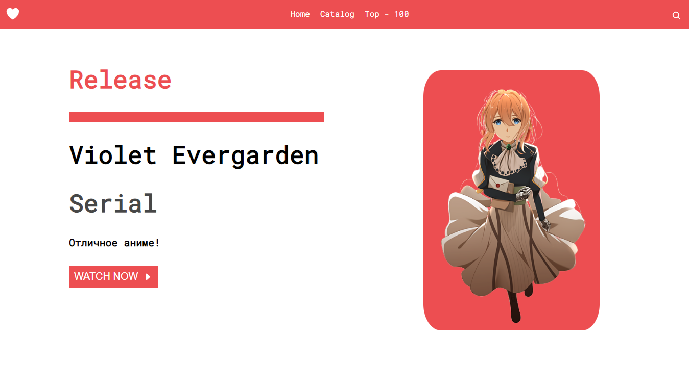
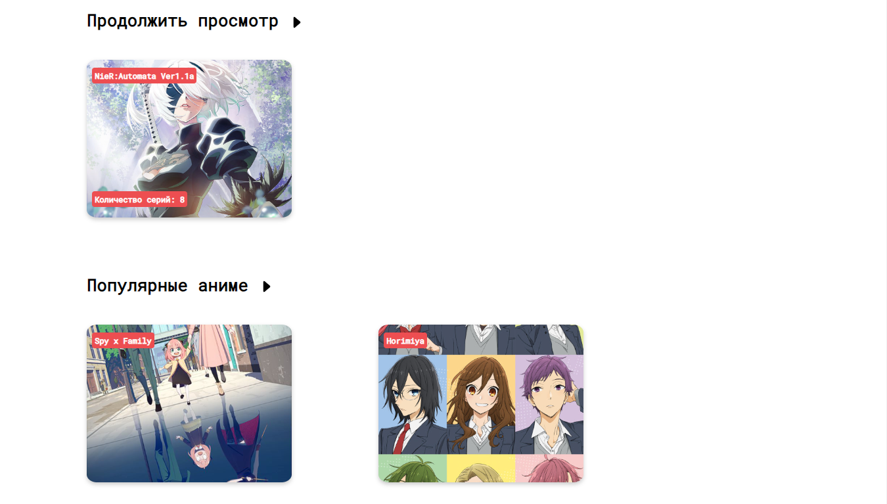
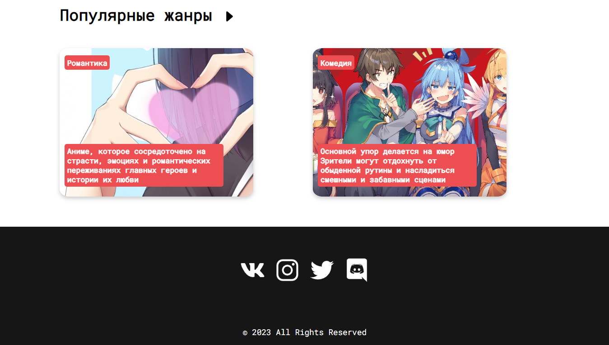
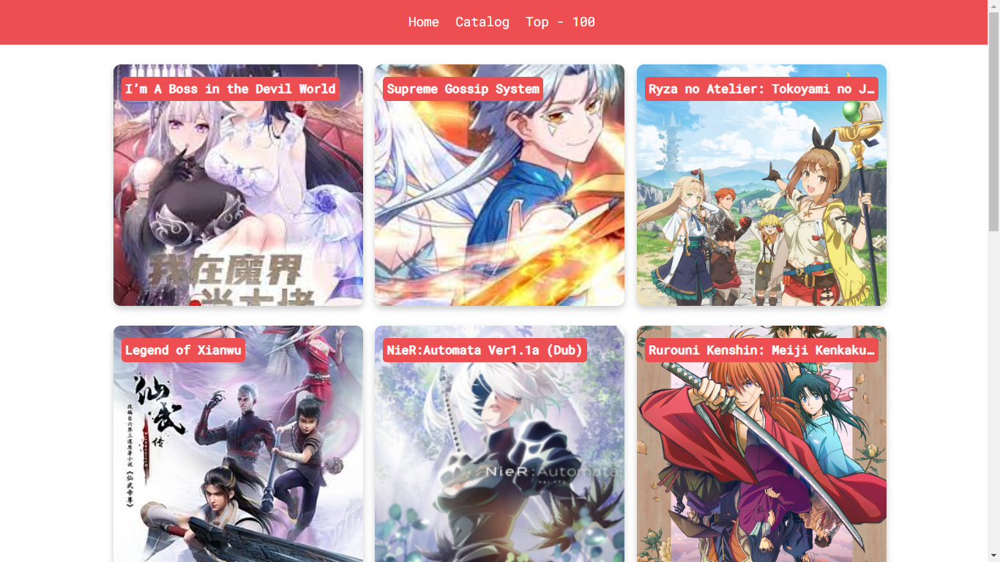
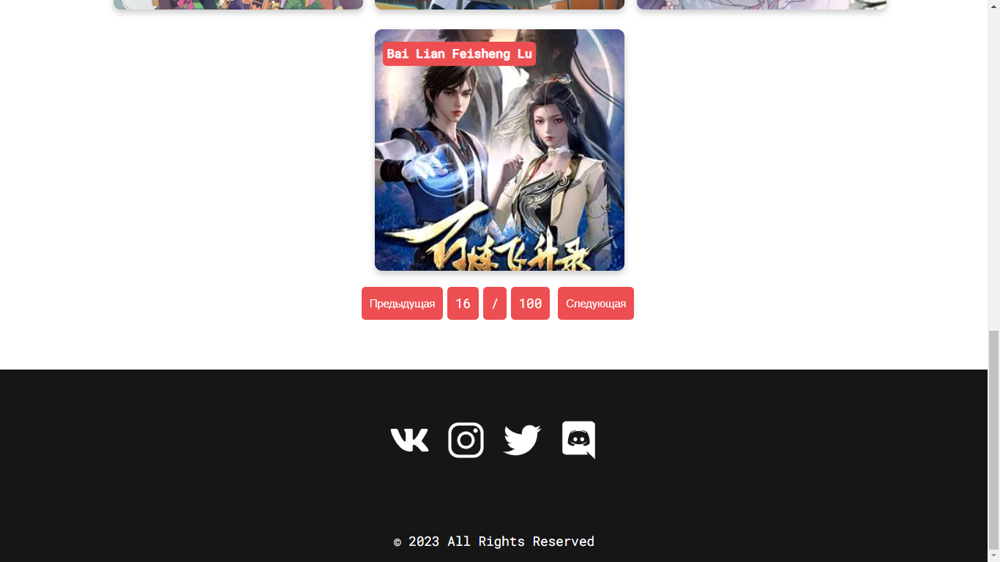
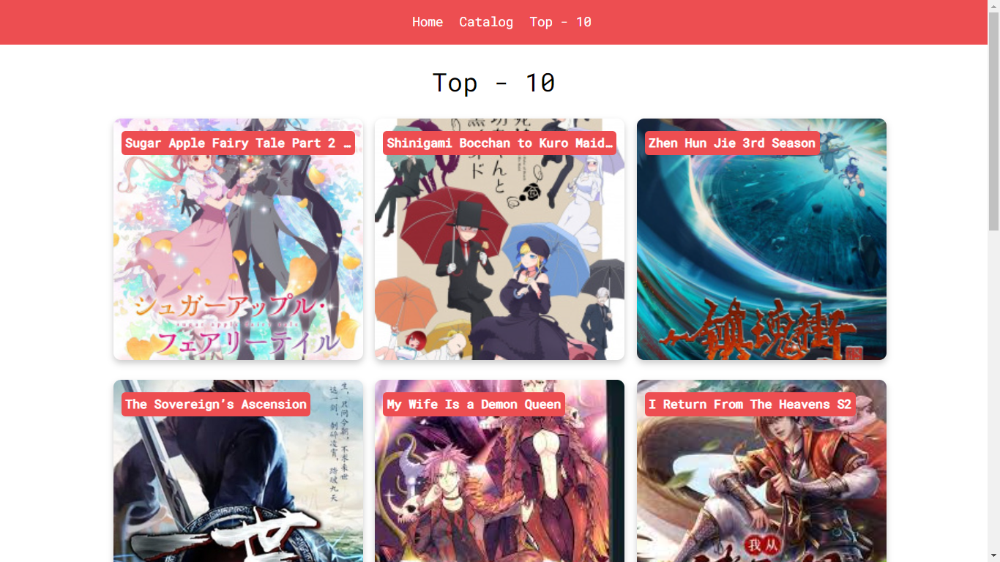

# **Верстка аниме сайта**

>## Технологии:

```
HTML + CSS + js + ionicons + api|consumet
```

>Установка:

```
1. git clone https://github.com/Skill-g/AnimeSite.git
2. cd AnimeSite-main
3. Установить [API](https://github.com/consumet/api.consumet.org/)
4. Изменить ссылки в api.js
5. Все запустить на хостинге, или на локальной машине
6. Готово
```


>Изображения:

- >Home




- >Catalog



- >TOP - 10

